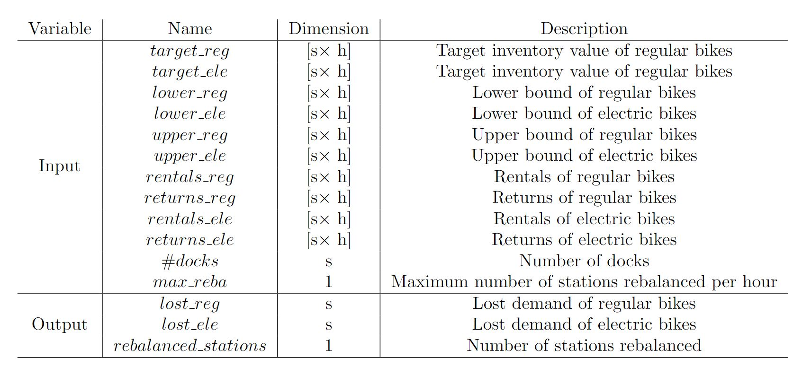
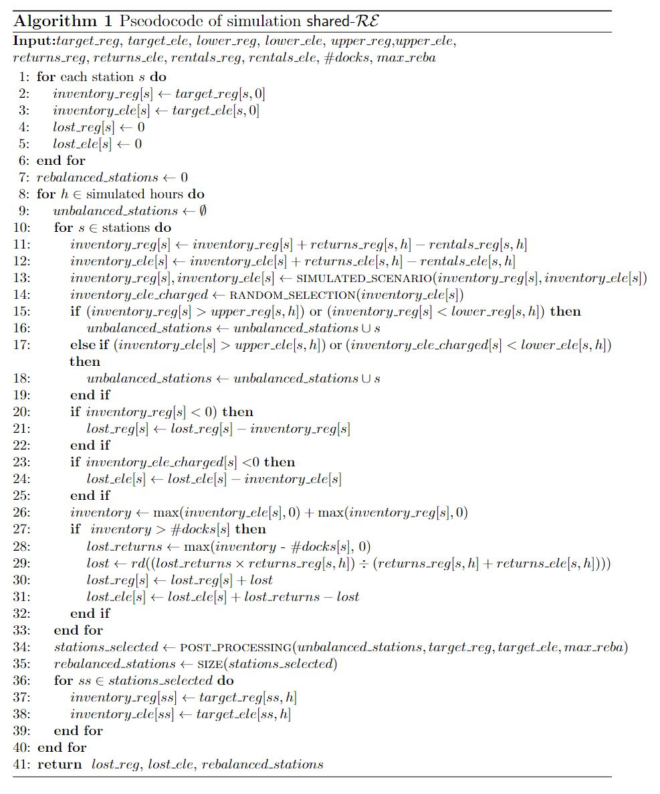

### Pseudocode of simulation

Here we present the pseudocode of the simulation $\text{shared}-\mathcal{RE}$. Assuming that $s$ is the number of stations in the network and $h$ is the number of simulated hours, the below presents the description and dimension of the inputs and outputs of the pseudocode.

The Algorithm below presents the pseudocode of the simulation $\text{shared}-\mathcal{RE}$. The simulation starts by initializing the variables that represent the inventory of regular bikes and electric bikes ($inventory_reg$ and $inventory_ele$) with the corresponding target inventory values for all stations in the network. Similarly, the arrays that store lost demand for regular and electric bikes ($lost\_reg$ and $lost\_ele$) of all stations are set to zero. At last, the variable that stores the number of rebalancing operations carried out in the simulation ($rebalanced\_stations$) is initialized as zero. From lines 8 to 41, there is a loop that goes through all simulated hours, followed by another loop, between lines 10 and 34, that iterates over the stations in the network. At the beginning of each simulated hour, line 9, the list of unbalanced stations ($unbalanced\_stations$) is set as empty. From lines 11 to 13, the inventory of regular and electric bikes is updated according to the rentals and returns (lines 11 and 12) and the possible bike substitution if the first bike of choice is not available (line 13). In line 14, the number of e-bikes with charged batteries is assigned to the variable $inventory\_ele\_charged$. Then, the algorithm verifies if the inventory of regular bikes or e-bikes is outside the inventory intervals and, if so, the station $s$ is added to the list $unbalanced\_stations$ (lines 15 to 19). Next, the algorithm checks if the inventory of regular bikes ($inventory\_reg$) and the inventory of e-bikes with charged batteries ($inventory\_ele\_charged$) is negative and, if so, this number is added to the corresponding lost demand variable (lines 20 to 25). After, the algorithm computes the total inventory of station $s$, line 26, by summing regular, and electric inventories and converting possible negative inventories to zero -- this strategy is used to prevent possible negative values from reducing the total inventory. Then, by checking if the total inventory is higher than the number of docks at the station $s$, line 27, the algorithm can verify if there are occurrences of return lost demand. If the return lost demand is confirmed, the algorithm cannot identify which type of bike resulted in the lost demand since the trips took place simultaneously at the hour $h$, not being able to pinpoint the chronological order of the returns. To solve this problem, first, the total number of return lost demand is stored in the variable $lost\_return$ (line 28). Second, the algorithm assigns the number of return lost demand to $lost\_reg$ and $lost\_ele$ according to the proportion of returns observed in the simulated hour $h$ (lines 29 to 31). After going through all the stations at hour $h$, the algorithm selects which stations are going to be rebalanced based on the procedure presented in Appendix A. In line 35, the variable $rebalanced\_stations$ sums the number of stations selected to be rebalanced in hour $h$ to its current value. The stations selected to be rebalanced have their inventory restored to their corresponding target inventory value. After going through all the simulated hours, the algorithm returns the computed values of lost demand for regular, and electric bikes and the number of rebalancing operations.  

